# 分布式秒杀系统
## 项目介绍

　　基于Spring+SpringMVC+Hibernate+Dubbo分布式开发系统架构，提供高并发、分布式秒杀系统解决方案，项目以电商业务为背景，主要包含商品管理、订单管理、支付中心、商家资金管理、买家资金管理、积分管理、可靠消息服务这七个模块。秒杀环节分别采用队列、乐观锁、分布式锁实现，分布式事务采用TCC、可靠消息服务两种方式，尽可能展示在高并发、分布式事务环境中的解决思路。

## 功能结构
``` lua
jecp
├── jecp-common-core -- SSH框架公共模块
├── jecp-dubbo-shop
|  ├── jecp-dubbo-shop-order-api -- rpc商品订单接口
|  ├── jecp-dubbo-shop-order -- rpc商品订单服务提供者
|  ├── jecp-dubbo-shop-product-api -- rpc商品管理接口
|  └── jecp-dubbo-shop-product -- rpc商品管理服务提供者
├── jecp-dubbo-trade-api -- rpc交易中心接口
├── jecp-dubbo-trade -- rpc交易中心服务提供者
├── jecp-dubbo-message-api -- rpc可靠消息服务接口
├── jecp-dubbo-message -- rpc可靠消息服务提供者
├── jecp-dubbo-message-job -- 可靠消息异常定时处理
├── jecp-dubbo-capital
|  ├── jecp-dubbo-capital-buyer-api -- rpc买家资金管理服务提供者
|  ├── jecp-dubbo-capital-buyer -- rpc买家资金管理接口
|  ├── jecp-dubbo-capital-seller-api -- rpc卖家资金管理服务提供者
|  ├── jecp-dubbo-capital-seller -- rpc卖家资金管理接口
|  ├── jecp-dubbo-capital-point-api -- rpc用户积分管理服务提供者
|  └── jecp-dubbo-capital-point -- rpc用户积分管理接口
└── jecp-dubbo-shop-web -- Web前台相关
```
## 技术选型
技术 | 名称 | 官网
----|------|----
Spring Framework | 容器  | [http://projects.spring.io/spring-framework/](http://projects.spring.io/spring-framework/)
SpringMVC | MVC框架  | [http://docs.spring.io/spring/docs/current/spring-framework-reference/htmlsingle/#mvc](http://docs.spring.io/spring/docs/current/spring-framework-reference/htmlsingle/#mvc)
Hibernate | ORM框架  | [http://www.mybatis.org/mybatis-3/zh/index.html](http://www.mybatis.org/mybatis-3/zh/index.html)
Hibernate validation | 校验框架  | [http://hibernate.org/validator/](http://hibernate.org/validator/)
Druid | 数据库连接池  | [https://github.com/alibaba/druid](https://github.com/alibaba/druid)
ZooKeeper | 分布式协调服务  | [http://zookeeper.apache.org/](http://zookeeper.apache.org/)
Dubbo | 分布式服务框架  | [http://dubbo.io/](http://dubbo.io/)
Tcc-transaction | TCC框架  | [https://github.com/changmingxie/tcc-transaction](http://dubbo.io/)
Redis | 分布式缓存数据库  | [https://redis.io/](https://redis.io/)
RabbitMq | 消息中间件  | [http://www.rabbitmq.com/](http://www.rabbitmq.com/)
Aspectj | 面向切面框架  | [http://www.eclipse.org/aspectj/](http://www.eclipse.org/aspectj/)
Quartz | 作业调度框架  | [http://www.quartz-scheduler.org/](http://www.quartz-scheduler.org/)
Log4J | 日志组件  | [http://logging.apache.org/log4j/1.2/](http://logging.apache.org/log4j/1.2/)
Fastjson | 数据序列化  | [https://github.com/alibaba/fastjson](https://github.com/alibaba/fastjson)
Maven | 项目构建管理  | [http://maven.apache.org/](http://maven.apache.org/)
Jquery | JavaScript框架  | [http://jquery.com/](http://jquery.com/)
Easyui | 前端框架  | [http://www.jeasyui.com/index.php](http://www.jeasyui.com/index.php)
## 主要技术点

### 分布式秒杀业务
#### 1、秒杀商品管理回收
利用RabbitMq的TTL特性建立延迟队列，实现秒杀活动结束后回收剩余库存；开启rabbitmq事务模式"rabbitTemplate.setChannelTransacted(true)"，创建秒杀活动和发送回收库存消息在一个事务中，可实现类似弱XA事务，即如果发送消息在事务中报错则整体事物回滚，如果在事务提交后RabbitMq异常则报"TransactionSynchronizationUtils.java(174) - TransactionSynchronization.afterCompletion threw exception"异常，数据库事务不回滚。如需消息跟数据库共享事务则需实现XA协议（个人理解）。 
#### 2、可根据需要制定不同秒杀策略
利用Redis，实现了队列、乐观锁、分布式事务锁三种策略，每个秒杀活动均可选择任意一种，测试高并发环境下这三种策略性能，便于应用到后续项目中。
#### 3、实现LocalCahce
1)用ConcurrentHashMap来做本地缓存，缓存对象为SoftReference，避免内存溢出；  
2)用DelayQueue来实现缓存有效时间，及时清除过期过期缓存；  
#### 4、页面静态化、对象缓存、秒杀结果缓存
1)所有页面均为Html，所需动态数据是通过接口从服务端获取，实现前后端分离；  
2)需要频繁查询的对象，如商品详情等可缓存到LocalCahce中，减少对数据库的访问；  
3)用LocalCahce缓存商品秒杀结束标志，如果LocalCahce中没有在去Redis中查找，减少对Redis访问；  
#### 5、利用Redis实现"限流"
制定秒杀活动后按策略将库存缓存至redis中，只容许秒杀成功的用户进入数据库下单；
#### 6、用消息中间件实现“削峰”
活动秒杀资格后的商品订单均通过消息发送到RabbitqMq中异步执行；
#### 7、解决重复下单、超卖
1)成功获得秒杀资格的用户在Redis中缓存，如果存在的直接返回，建立订单表字段:“商品ID+用户ID”唯一索引，来保障无重复下单；   
2)更新库存时，利用数据库行锁判在更新条件中判断库存大于0，根据返回行数来判断是否成功；   
#### 8、JSR303参数校验、全局异常处理
分别用Hibernate validation、springmvc注解@ControllerAdvice实现；
#### 9、微服务、分布式
秒杀成功后需要扣减商品库存、生成商品订单、支付记录，这些功能均为独立服务、数据库并且要在同一事务中，用tcc-transaction框架来保障分布式事务一致性；
### 分布式支付业务
场景：用户用余额支付订单，成功后需更新订单状态、更新支付记录状态、商家加款、买家扣款、增加用户积分而这些服务、数据库均为分布式应用，需要用分布式事务来保证最终一致。 
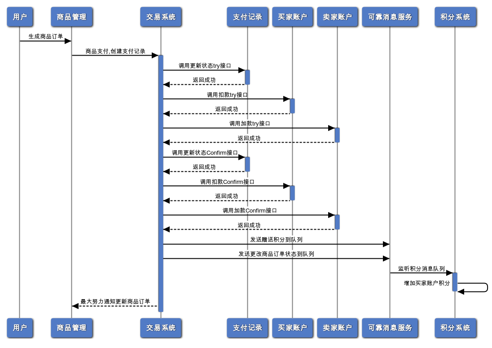
#### 1、tcc框架
1)采用github上收藏最多的tcc-transaction框架，主要用于更新支付记录、商家加款、买家扣款；  
2)tcc-transaction在执行时try阶段为串行，confirm、cancel为并行，可根据需要开启Dubbo异步调用让try阶段也为并行；
#### 2、重复支付
update订单状态时需根据全局ID(GTID)、状态作为条件，然后判断更新返回行数是否等于1，如果为0则订单已支付；
#### 3、谈谈悲观锁、乐观锁、数据库行锁
支付中买家扣款可用数据库悲观锁for update锁定所在行在进行业务处理、更新记录，也可直接利用数据库行锁直接update记录，例如"update CapitalAccount set balance=balance-:tradeAmount,balance_frozen=balance_frozen+:tradeAmount where user_id=:userid and balance>=:tradeAmount"，建议使用行锁提高性能；买家账户也可使用乐观锁，但商家账户不建议使用乐观锁，所有订单对应一条商家记录，更新冲突频率太高会降低性能；
#### 4、可靠消息服务
主要用于增加用户积分，具体流程如下:
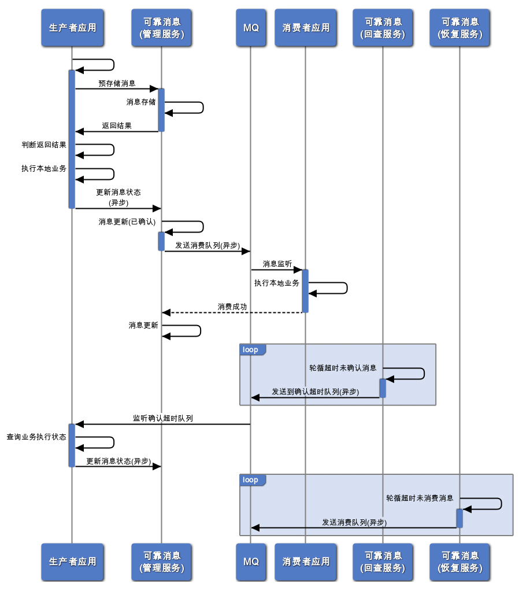
## 部署
1)测试机配置:  
CPU型号:Xeon E3 核数:4 内存:32G 硬盘:机械1T+128G SSD  操作系统:centos 7.6  
1)redis、rabbitmq、zookeeper所有Oracle数据库均由Docker容器构建，并将ssd硬盘mount到docker目录下，可参考网上相关命令；    
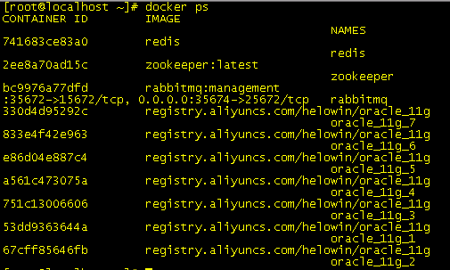 
2)修改项目中resources下相关文件中对应ip地址；
3)jecp-dubbo-shop-web放到服务器tomcat下;  
4)所有可执行的dubbo服务jar放到服务器相关目录，并创建shell启停脚本，参考dubbo-capital-buyer-service.sh；运行dubbo-capital-buyer-service.sh statrt|stop 完成启停；    
5)增加oracle process数量，增加redo大小，可参考网上命令；  
6)调整centos参数  
echo 30 > /proc/sys/net/ipv4/tcp_fin_timeout(调低端口释放后的等待时间， 默认为60s， 修改为15~30s)  
echo 1 > /proc/sys/net/ipv4/tcp_tw_reuse(默认为0， 修改为1， 释放TIME_WAIT端口给新连接使用)  
echo 1 > /proc/sys/net/ipv4/tcp_tw_recycle(快速回收socket资源，  默认为0， 修改为1)  
7)部署图  

## 压力测试
### 说明:  
1)实时交易系统数据提交比较频繁即硬盘IOPS会比较高，如果用个人PC测试建议使用SSD，械硬盘IOPS约为160左右基本无法压测，测试比对数据如下:  
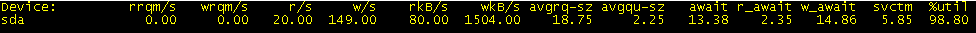使用机械硬盘iops为169，使用率:98.8%  
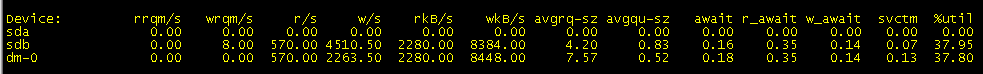换为SSD后iops为5000+，使用率:37.95%   
2)测试工具使用Jmeter;  
3)接口:  
生成所有cookie：http://127.0.0.1:8080/jecp/userBuildAllCookies   
导出所有交易记录ID:http://127.0.0.1:8080/jecp/trade/record/allTradeId  
秒杀接口:http://127.0.0.1:8080/jecp/shop/secKill/secKill  
支付接口:http://127.0.0.1:8080/jecp/shop/order/pay  
### 秒杀场景:  
场景涉及商品管理、订单管理、支付管理三个服务，商品扣减库存后要生产订单和支付记录，测试内容:  
1)模拟10W用户同时秒杀1000件商品，测试秒杀业务性能；  
2)模拟1W用户分别用队列、乐观锁、分布式锁三种策略同时秒杀1W件商品，比对三种策略性能情况；   
3)商品售出量、订单量、支付记录总数是否相等；  
开始测试，根据测试需求建立秒杀活动:  
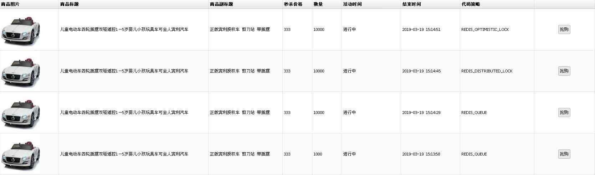  
使用10W用户cookie秒杀1000件商品，200线程 500次:   
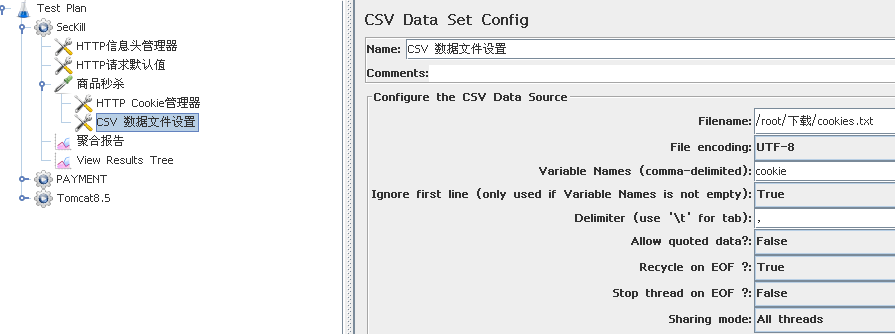  
测试结果:  
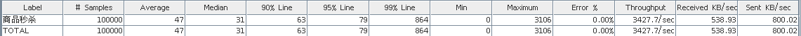  
1W用户cookie秒杀1W件商品，使用队列策略，测试结果:  
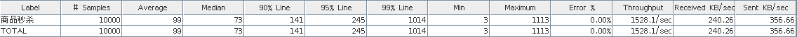  
使用乐观锁策略，测试结果:  
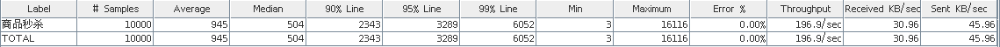  
使用分布式锁策略，测试结果:  
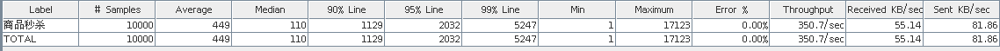  
秒杀商品合计31000件，检查订单数量、支付记录数量是否相等，跟商品销售量匹配  
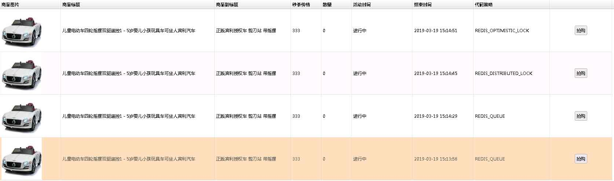 
商品剩余量全为0，即卖出合计31000件  
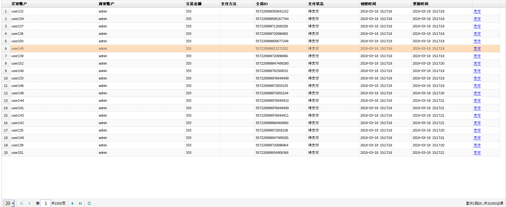  
支付记录总量31000条    
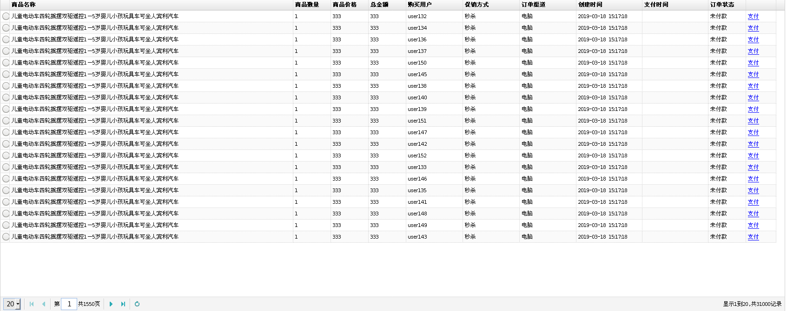  
订单总量31000条  
**总结**:订单数量、支付记录数量相等并与商品销售量匹配，200线程并发下分布式秒杀场景吞吐量>3400，秒杀场景三种策略中队列策略性能最好，由于秒杀场景生产订单是异步，测试数据中不能充分体验分布式事务性能，接下来便测试分布式事务。  
### 分布式事务场景:  
场景涉及订单管理、支付管理、买家资金管理、商家资金管理、可靠消息服务、积分管理，测试内容:  
1)导出所有交易记录ID添加到Jmeter中，测试总量30000条，资金总额:30000*330=9990000，测试买家资金扣减、商家资金增加、可靠消息数量、积分增加是否相等，支付记录、订单状态是否更改；    
2)测试分布式事务性能；  
**测试结果:**  
订单库统计:  
`select count(*) from shop_order where status='COMPLETED'`输出结果:30000  
支付记录库统计:  
`select count(*) from trade_record where status='PAY_SUCCESS'`输出结果:30000  
买家资金库统计:  
`select /*sum(初始资金-余额)*/sum(100000-balance) from capital_account`输出结果:9990000.00  
商家资金库统计:  
`select balance from capital_account`输出结果:9990000.00  
可靠消息库统计:  
select count(*) from reliable_message_deleted where status='CONSUMED'输出结果:30000  
积分库统计:  
`select sum(total_points) from account_point`输出结果:9990000  
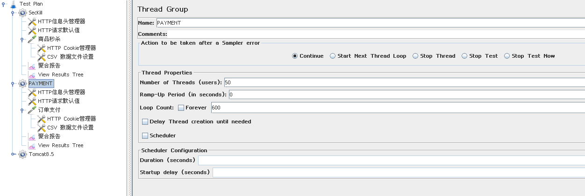
50线程
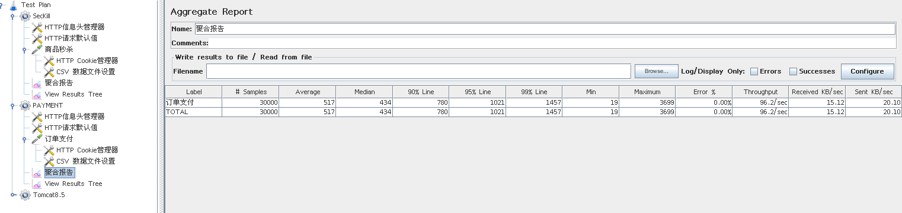  
100线程   
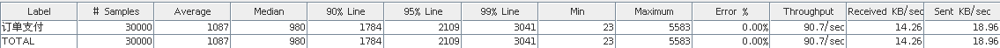  
cpu平均负载已达85%，硬件资源已达瓶颈    
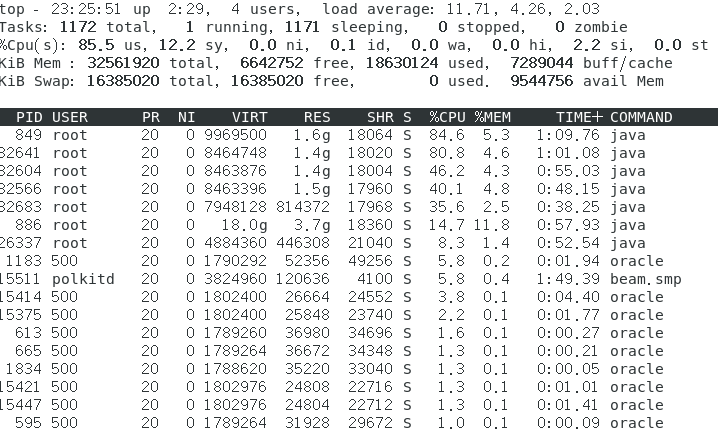   
**总结**:场景测试中数据可靠性没问题，性能平均TPS>90。
